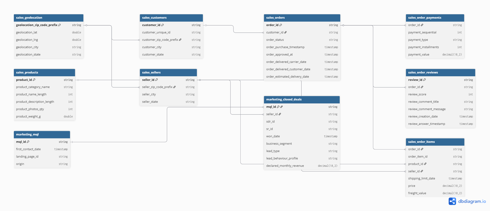

# Olist Marketplace-as-a-Service Analytics

TLDR: I built an end-to-end e-commerce analytics platform on AWS and Databricks, modelling R$16M GMV across 100K+ orders to identify R$1.1M in recoverable annual revenue through delivery delay analysis, RFM customer segmentation, and AI agents that surface operational insights to non-technical stakeholders without SQL.

---

## 1. Project Overview

### Who

Olist is a Brazilian Marketplace-as-a-Service (MaaS) platform that acts as a digital bridge between small-to-medium local merchants and major national retailers (Amazon, Mercado Livre, Americanas). Rather than each merchant maintaining their own storefront, Olist consolidates them under a single high-reputation account, handling discovery, fulfilment coordination, and payments.

There are two sides to the marketplace:
- Sellers (B2B): 3,000+ merchants ranging from boutique shops to large distributors, dependent on Olist for reach and order volume.
- Customers (B2C): ~96,000 unique buyers spread across all 26 Brazilian states, each with different expectations shaped by where they live.

### What

This project analyses three years of Olist transaction data (2016 to 2018), a period of 138% year-on-year growth, covering 100,000+ orders, 8,000+ marketing leads, and a 588,000-user advertising experiment, to answer four business-critical questions:

1. Revenue: What geographic and economic factors drive sales performance across Brazil's 26 states?
2. Logistics: Where does national infrastructure disparity inflate freight costs and delivery lead times?
3. Segmentation: Which customer cohorts and product categories generate the highest lifetime value?
4. Churn: What are the exact delivery delay thresholds that trigger customer dissatisfaction and revenue leakage?

The three datasets are integrated through a snowflake schema with Orders as the central fact table:

### Where

Brazil's geography creates unequal conditions for e-commerce. The analysis classifies all 26 states into three infrastructure tiers, each with distinct delivery performance and customer behaviour:

| Tier | Regions | Average Delivery | On-Time Rate |
|---|---|---|---|
| Tier 1 | Southeast (SP, RJ, MG, ES) | 9.5 days | 91% |
| Tier 2 | South, Central-West | 12 days | 85% |
| Tier 3 | North, Northeast | 17 days | 72% |

These tiers are not just descriptive. They define different customer expectations, different delay tolerances, and different intervention thresholds. A one-size-fits-all SLA serves no one well.

### Why

Despite strong top-line growth, Olist faces a retention problem, not a growth problem. The platform successfully attracts customers and converts orders but loses them at the final mile. Every percentage point improvement in on-time delivery translates directly into revenue retained.

8.2% of delivered orders cross their regional breaking point each year. Each one represents a customer who received a poor experience and is unlikely to return, forfeiting R$139 in expected future value. Across the platform, that amounts to $1.1M in annual revenue at risk, recoverable with targeted, data-driven action.

### How

> Built on AWS (S3, Lambda, Terraform) and Databricks, with raw CSV data progressively refined through a Medallion pipeline (Bronze, Silver, Gold) using dbt for transformations and Apache Airflow for orchestration. The Gold layer is exported to S3 as Parquet and consumed by Google Gemini 2.0 Flash AI agents that deliver daily executive summaries and on-demand root cause analysis.

---

## 2. Economic Model

Olist earns from three stacked revenue streams on every transaction. Each stream has a different failure mode, which is why this analysis tracks more than just top-line GMV.

| Revenue Stream | Mechanism | Financial Assumption |
|---|---|---|
| SaaS Subscriptions | Monthly platform fee | Any seller with at least one order in a given month is counted as Active and billed |
| Take Rate (Commission) | 15% of GMV | Industry-average commission applied to every successfully delivered order |
| Logistics Markup | 5% of freight value | Margin earned by reselling carrier capacity at scale, directly eroded by delays and refunds |

How each stream leaks:

- SaaS leaks when sellers churn. Poor logistics performance degrades a seller's own review scores, reducing their order volume until the platform no longer generates enough value to justify their subscription.
- Take Rate leaks when orders are cancelled or refunded. Late delivery and damaged goods are the primary drivers.
- Logistics Markup leaks when freight must be subsidised, refunded, or re-routed due to infrastructure disparities across Brazil's regions.

This is why Commission Leakage and Seller Churn are treated as leading indicators of total platform revenue health throughout this analysis, not lagging symptoms.

---

## 3. Business Journey

Olist is a two-sided marketplace. Revenue health depends on both sides functioning well simultaneously. The analysis applies the Acquisition, Retention, and Growth framework to each side, powered by RFM (Recency, Frequency, Monetary) scoring.

### Side A: Seller Journey (B2B Supply Side)

Sellers enter through a marketing funnel and progress through five measurable stages. Each stage has a data signal and a failure mode that can be detected early.

| Funnel Stage | Key Metric | Failure Signal |
|---|---|---|
| Lead Generation | MQL volume by origin channel | High paid spend producing low-quality leads |
| Qualification | Conversion rate and days to close | Long sales cycles reducing channel ROI |
| Onboarding | Time to first transaction | Sellers signing up but never completing a sale |
| Performance | GMV per seller and review score | Low GMV combined with low rating signals churn risk |
| Retention | Seller revenue tier (RFM Monetary axis) | A drop in tier is an early churn warning |

Sellers are also profiled by behavioural archetype, which shapes how the platform should engage with them:

| Archetype | Description | Engagement Strategy |
|---|---|---|
| Shark | Aggressive, high-volume, revenue-driven | Fast onboarding, volume incentives |
| Wolf | Growth-oriented, relationship-focused | Account management, co-marketing |
| Cat | Cautious, low-volume, quality-focused | Education resources, gradual scaling support |

### Side B: Customer Journey (B2C Demand Side)

The customer lifecycle runs across six stages. Each has a measurable signal and a targeted commercial intervention.

| Stage | Goal | Data Signal | Intervention |
|---|---|---|---|
| 1-3. Awareness to Consideration | Drive qualified traffic to listings | Search volume vs. product page visits | Flag poor listings; improve product descriptions |
| 4. Intent (Cart) | Minimise decision friction | Cart abandonment rate by region | Freight subsidies for high-intent cohorts in high-cost regions |
| 5. Purchase and Logistics | Fulfil on the SLA promise | SLA variance: actual vs. estimated delivery | Proactive voucher issued before the regional breaking point is crossed |
| 6. Advocacy | Convert buyers into repeat Champions | RFM Recency and Frequency scores, review sentiment | Referral incentives and product bundles for Potential Loyalists |

The Breaking Point at Stage 5 is the pivotal finding of this project. Delay tolerance is not uniform across Brazil. It varies by infrastructure tier, and a single national SLA is optimised for no one.

| Tier | Regions | Breaking Point | Intervention Threshold |
|---|---|---|---|
| Tier 1 | Southeast | 5 days late | Issue voucher at day 4 |
| Tier 2 | South, Central-West | 7 days late | Issue voucher at day 6 |
| Tier 3 | North, Northeast | 10 days late | Issue voucher at day 9 |

When a shipment crosses its regional breaking point without intervention, a fulfilled order converts into a 1-star review, triggering Commission Leakage and Seller Churn. The damage compounds across all three revenue streams simultaneously.

### RFM Customer Segmentation

RFM scores map each customer into an actionable segment. Champions and Loyal Customers represent only 7% of the customer base but generate 28% of total revenue.

| Segment | Share of Customers | Priority Action |
|---|---|---|
| Champions | 2% | Reward and retain |
| Loyal Customers | 5% | Upsell to premium tiers |
| Potential Loyalists | 8% | Convert via bundles |
| At Risk | 15% | Win-back campaigns immediately |
| Hibernating | 48% | Reactivation campaigns |

---

## 4. Key Findings

### Platform Performance (2016-2018)

| Metric | Value |
|---|---|
| Total GMV | R$16.0M |
| Platform Revenue | R$2.4M |
| Logistics Revenue | R$320K |
| Total Orders | 99,441 |
| Delivered Orders | 96,478 (97%) |
| Active Sellers | 3,095 |
| YoY Growth (2017 to 2018) | 138% |

### Delivery Delay and Churn

Delivery delay is the single strongest predictor of customer dissatisfaction on the platform. The relationship is consistent and regionally structured.

| Delivery Status | Average Review Score | Churn Risk |
|---|---|---|
| On time or early | 4.21 / 5 | Low |
| 1-3 days late | 3.85 / 5 | Low |
| 4-6 days late | 3.12 / 5 | Medium |
| 7+ days late | 2.45 / 5 | High |

Orders delivered 7 or more days past the estimated date see a 42% decline in satisfaction. The damage is not linear: it accelerates sharply at the tier-specific breaking point, which is why intervening before that threshold matters.

Revenue at risk: 8.2% of delivered orders cross their regional breaking point, representing approximately R$1.1M in annual future revenue forfeited.

### Product Category Performance

These five categories deliver the highest revenue, highest ratings, and strongest repeat potential. They represent the most valuable real estate on the platform.

| Category | Revenue | Average Order Value | Average Rating |
|---|---|---|---|
| Health and Beauty | R$1.42M | R$147 | 4.12 |
| Watches and Gifts | R$1.38M | R$230 | 4.08 |
| Bed, Bath and Table | R$1.26M | R$132 | 4.15 |
| Sports and Leisure | R$1.14M | R$132 | 4.18 |
| Computers and Accessories | R$1.09M | R$139 | 4.05 |

The following categories generate meaningful revenue but carry below-average ratings, each with an identifiable root cause that points directly to a commercial fix.

| Category | Revenue | Average Rating | Root Cause |
|---|---|---|---|
| Office Furniture | R$420K | 3.45 | Delivery damage in transit |
| Large Appliances | R$380K | 3.38 | Disproportionately long delivery times |
| Garden Tools | R$210K | 3.52 | Seasonal demand volatility |

### Marketing Channel Efficiency

Not all acquisition channels are created equal. Referral converts fastest and closes soonest, yet receives the least investment.

| Channel | Conversion Rate | Average Days to Close |
|---|---|---|
| Referral | 14.7% | 19.5 days |
| Organic Search | 12.2% | 22.8 days |
| Paid Search | 10.4% | 28.4 days |
| Social Media | 9.0% | 31.2 days |

Advertising effectiveness: Paid ad exposure produced a 43% higher conversion rate compared to non-ad exposure. The highest-performing windows are Monday to Thursday, 10am to 4pm.

---

## 5. Strategic Recommendations

> Olist does not have a growth problem. It has a retention problem. Every percentage point improvement in on-time delivery translates directly to revenue retained.

### The Revenue Leakage Case

| Metric | Value |
|---|---|
| Orders crossing the breaking point annually | 7,911 |
| Lost future revenue per customer | R$139.30 |
| Total revenue at risk per year | R$1.1M |
| Recovery per 1,000 salvaged orders | R$33,845 |

### Recovery Scenarios

| Scenario | Annual Revenue Recovery | Investment Required | Payback Period |
|---|---|---|---|
| Do nothing | R$0 (R$1.1M continues to leak) | R$0 | None |
| Quick wins only | R$440K (40% recovery) | R$50K | ~6 weeks |
| Full implementation | R$880K (80% recovery) | R$200K | ~90 days |

---

### Immediate Actions: 0 to 30 Days

No new infrastructure required. These actions draw directly from data already produced by this pipeline.

| Priority | Action | Expected Impact |
|---|---|---|
| Critical | Deploy tier-specific SLA monitoring dashboard in Power BI | Real-time visibility into breaking points by region |
| Critical | Issue proactive vouchers at day 4 (Tier 1), day 6 (Tier 2), and day 9 (Tier 3) | Intercept churn before the breaking point crystallises |
| High | Reallocate 20% of paid search budget to a referral incentive programme | +8-12% overall conversion efficiency |
| High | Concentrate ad spend on Monday to Thursday, 10am to 4pm | +15% ad efficiency based on observed engagement patterns |

---

### Short-Term Initiatives: 30 to 90 Days

| Initiative | What It Does | Expected Return |
|---|---|---|
| Carrier Performance Scoring | Rate carriers by tier; penalise underperformers contractually | 10% SLA improvement |
| RFM Win-Back Campaigns | Automated outreach to the At Risk segment (15% of customers) | 12% reactivation rate |
| Health and Beauty Subscription Pilot | Introduce recurring orders for the top-revenue category | 25% LTV increase for converted subscribers |
| Regional Warehouse Feasibility Study | Assess whether a Tier 3 fulfilment node reduces average North/Northeast delivery from 17 to 12 days | Unlocks orders currently arriving past the breaking point |
| Office Furniture and Large Appliances Fix | Mandate reinforced packaging for furniture; establish dedicated carrier contracts for bulky goods | Lift ratings from 3.38-3.45 toward the platform average |
| Garden Tools Inventory Planning | Pre-position stock before peak seasons; automate markdown triggers post-season | Reduces seasonal revenue volatility |

---

### Long-Term Strategic Investments: 90+ Days

| Investment | What It Does | Strategic Value |
|---|---|---|
| Predictive Delay Model | Flags at-risk shipments before dispatch using carrier, route, and historical data | Shifts from reactive customer service to proactive logistics rerouting |
| Seller Quality Score | Composite score (GMV, review rating, SLA compliance) that influences search visibility | Creates a self-improving marketplace where quality is commercially rewarded |
| Regional Dynamic Pricing Engine | Applies freight subsidies automatically for Tier 3 cohorts in high-intent, high-value categories | Closes the conversion gap in the North and Northeast without blanket discounting |
| AI-Powered RCA Agent | Full rollout of the AI chatbot to operations, customer service, and marketing teams | Democratises data access; non-technical stakeholders answer their own questions without SQL |

---

### Marketing Channel Reallocation

Referral is the highest-converting, fastest-closing channel on the platform. It receives 2% of lead volume. The case for reallocation is clear.

| Channel | Current Budget Share | Conversion Rate | Recommended Action |
|---|---|---|---|
| Paid Search | ~40% | 10.4% | Reduce by 20% |
| Referral Programme | ~2% | 14.7% | Reinvest freed budget here |
| Organic Search | Zero cost | 12.2% | Increase SEO content investment |

Redirecting 20% of paid spend to referral incentives is projected to improve overall funnel conversion by 8-12%, with close cycles shortening from 28 days to under 20 days.

---

## Dataset Sources

| Dataset | Source | Size |
|---|---|---|
| Brazilian E-Commerce Public Dataset | [Kaggle](https://www.kaggle.com/datasets/olistbr/brazilian-ecommerce) | ~100K orders |
| Marketing Funnel Dataset | [Kaggle](https://www.kaggle.com/datasets/olistbr/marketing-funnel-olist) | ~8K MQLs |
| Marketing A/B Testing Dataset | [Kaggle](https://www.kaggle.com/datasets/faviovaz/marketing-ab-testing) | ~588K users |