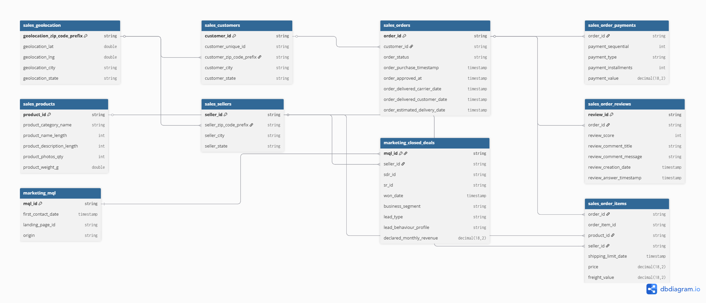

# Olist Ecommerce Analytics

**TLDR:** End-to-end e-commerce analytics platform on AWS and Databricks, modelling R$16M GMV across 100K+ orders to identify R$1.1M in recoverable annual revenue through delivery delay analysis, RFM customer segmentation, and AI agents that surface operational insights without SQL.

**Stack:** Databricks, dbt, Apache Airflow, AWS S3, Terraform, Power BI, Google Gemini 2.0 Flash

---

## About

Olist is a Brazilian Marketplace-as-a-Service (MaaS) platform that connects 3,000+ small-to-medium merchants with major national retailers (Amazon, Mercado Livre, Americanas). Rather than each merchant maintaining their own storefront, Olist consolidates them under a single high-reputation account, handling discovery, fulfilment coordination, and payments. The marketplace has two sides: sellers (B2B, 3,000+ merchants) and customers (B2C, ~96,000 unique buyers across all 26 Brazilian states).

This project analyses three years of Olist transaction data (2016 to 2018), a period of 138% year-on-year growth, covering 100,000+ orders, 8,000+ marketing leads, and a 588,000-user advertising experiment.

### Revenue model and assumptions

Olist earns from three stacked revenue streams on every transaction. Each stream has a different failure mode, which is why this analysis tracks more than just top-line GMV.

| Revenue stream | Mechanism | Assumption |
|---|---|---|
| SaaS subscriptions | Monthly platform fee | Any seller with at least one order in a given month is counted as active and billed |
| Take rate (commission) | 15% of GMV | Industry-average commission applied to every successfully delivered order |
| Logistics markup | 5% of freight value | Margin earned by reselling carrier capacity at scale, directly eroded by delays and refunds |

### Infrastructure tier classification

Brazil's geography creates unequal conditions for e-commerce. The analysis classifies all 26 states into three infrastructure tiers based on observed delivery performance and on-time rates. These tiers define different customer expectations, different delay tolerances, and different intervention thresholds.

| Tier | Regions | Avg delivery | On-time rate |
|---|---|---|---|
| Tier 1 | Southeast (SP, RJ, MG, ES) | 9.5 days | 91% |
| Tier 2 | South, Central-West | 12 days | 85% |
| Tier 3 | North, Northeast | 17 days | 72% |

The breaking points (the delay threshold at which satisfaction collapses) vary by tier.

---

## The problem

Despite strong top-line growth, Olist has a retention problem, not a growth problem. The platform successfully converts orders but loses customers at the final mile.

**4.8%** of delivered orders suffer material delay (3+ days past estimate), producing an average review score of **1.85/5** and suppressing ratings across **959 sellers**. The damage compounds across all three revenue streams simultaneously.

Satisfaction drops 60% once a shipment crosses its tier-specific breaking point. The damage is not linear:

| Delivery status | Avg review | Churn risk |
|---|---|---|
| On time or early | 4.29 | Low |
| 1-3 days late | 3.29 | Low |
| 4-6 days late | 2.18 | Medium |
| 7+ days late | 1.73 | High |

The breaking point varies by tier:

| Tier | Breaking point | Intervention threshold |
|---|---|---|
| Tier 1 (Southeast) | 5 days late | Issue voucher at day 4 |
| Tier 2 (South, Central-West) | 7 days late | Issue voucher at day 6 |
| Tier 3 (North, Northeast) | 10 days late | Issue voucher at day 9 |

When a shipment crosses its regional breaking point without intervention, a fulfilled order converts into a 1-star review, triggering commission leakage and seller churn.

---

## The solution

### Immediate (0 to 30 days), no new infrastructure required

| Action | Expected impact |
|---|---|
| Deploy tier-specific SLA monitoring dashboard | Real-time visibility into breaking points by region |
| Issue proactive vouchers before the breaking point (day 4 / 6 / 9 by tier) | Intercept churn before it crystallises |
| Reallocate 20% of paid search to referral programme (14.7% vs 10.4% conversion) | +8-12% overall funnel conversion |
| Concentrate ad spend on Mon to Thu, 10am to 4pm | +15% ad efficiency |

### Short-term (30 to 90 days)

| Initiative | Expected return |
|---|---|
| Carrier performance scoring with contractual penalties | 10% SLA improvement |
| RFM-driven win-back campaigns for At Risk segment (16% of customers, 19% of revenue) | 12% reactivation rate |
| Health and Beauty subscription pilot (top revenue category, R$1.42M) | 25% LTV increase |
| Reinforced packaging for furniture; dedicated carrier contracts for bulky goods | Lift ratings from 3.38-3.45 toward platform average |

### Long-term (90+ days)

| Initiative | Strategic value |
|---|---|
| Predictive delay model to flag at-risk shipments before dispatch | Shift from reactive CS to proactive logistics rerouting |
| Seller quality score influencing search visibility | Self-improving marketplace where quality is commercially rewarded |
| Regional dynamic pricing engine for Tier 3 freight subsidies | Freight is 18% of order value in Tier 3 vs 13% in Tier 1 |
| Tier 3 regional warehouse | ~70% of sellers are in the Southeast; carrier optimisation alone cannot close the distance gap |
| AI-powered RCA agent for ops, CS, and marketing teams | Non-technical stakeholders answer their own questions without SQL |

---

## The impact

| Revenue stream | Annual leakage |
|---|---|
| Materially delayed orders (4.8% of delivered, avg review 1.85) | R$856K |
| Seller commission suppression (959 sellers, 10% GMV at risk) | R$187K |
| **Total recoverable** | **R$1.1M** |

### Recovery scenarios

| Scenario | Annual recovery | Investment | Payback |
|---|---|---|---|
| Do nothing | R$0 (R$1.1M continues to leak) | R$0 | None |
| Quick wins only | R$440K (40%) | R$50K | ~6 weeks |
| Full implementation | R$880K (80%) | R$200K | ~90 days |

---

## Key analytical components

**RFM customer segmentation.** Champions and Loyal Customers represent 29% of the customer base but generate 43% of total revenue. At Risk customers (16%) represent 19% of revenue and are the highest-priority win-back target.

**Seller archetypes.** Market Leaders (3% of sellers, 21% of GMV), Innovators (7%, 35%), and Stable Partners (90%, 44%) each require different engagement strategies from co-marketing to scaling support.

**Geographic supply-demand imbalance.** ~70% of sellers are in the Southeast, structurally disadvantaging Tier 3 customers with longer shipping distances, higher freight (18% vs 13% of order value), and lower on-time rates (72% vs 91%).

**Marketing channel efficiency.** Referral converts at 14.7% in 19.5 days vs paid search at 10.4% in 28.4 days, yet receives only 2% of lead volume.

---

## How it was built

Three Kaggle datasets (100K+ orders, 8K MQLs, 588K-user ad experiment) ingested into AWS S3 and refined through a Medallion pipeline (Bronze to Silver to Gold) on Databricks, using dbt for transformations. Gold layer exports to S3 as Parquet, consumed by:

- Power BI dashboards for KPI monitoring and SLA tracking
- Google Gemini 2.0 Flash AI agents for daily executive summaries and quick root cause analysis directions.

---

## Data sources

| Dataset | Source | Size |
|---|---|---|
| Brazilian E-Commerce Public Dataset | [Kaggle](https://www.kaggle.com/datasets/olistbr/brazilian-ecommerce) | ~100K orders |
| Marketing Funnel Dataset | [Kaggle](https://www.kaggle.com/datasets/olistbr/marketing-funnel-olist) | ~8K MQLs |
| Marketing A/B Testing Dataset | [Kaggle](https://www.kaggle.com/datasets/faviovaz/marketing-ab-testing) | ~588K users |
